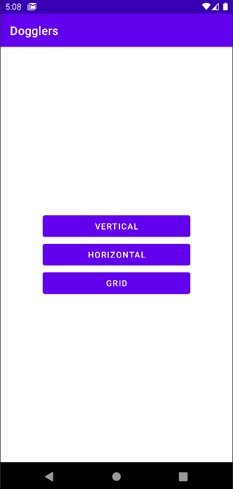
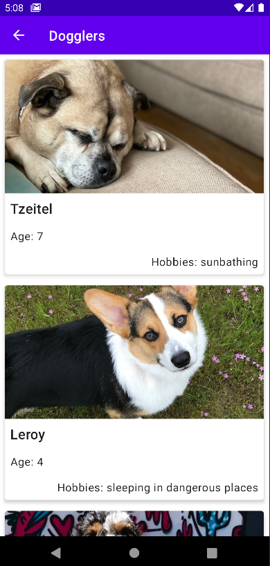
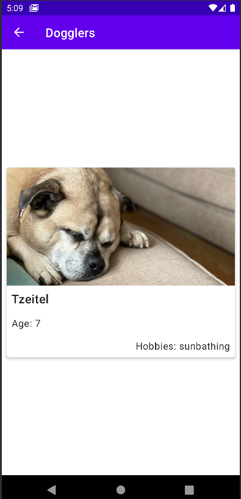
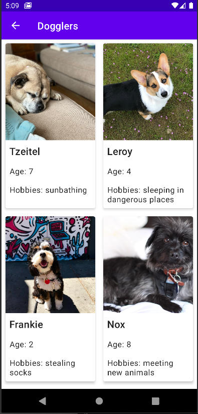
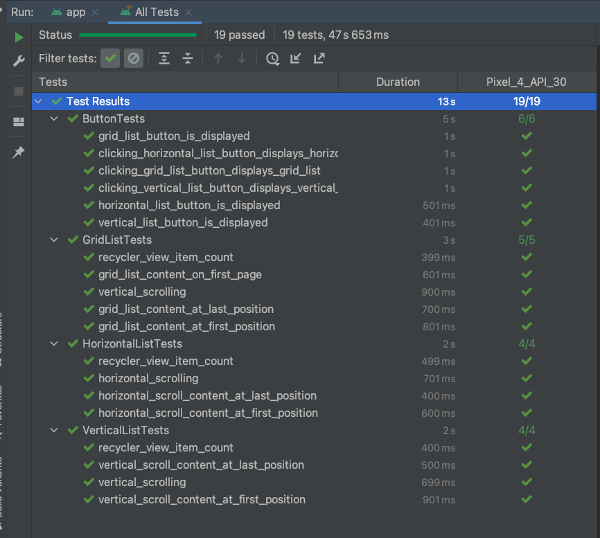

Dogglers 
==================================

**Description**

An Android Application that displays doogler profiles in three different layouts:
- vertical
- horizontal
- grid

Project sourced from:
- [Project: Dogglers app](https://developer.android.com/codelabs/basic-android-kotlin-training-project-dogglers-app)
- Starter code for the independent project for [google-developer-training/android-basics-kotlin-dogglers-app](https://github.com/google-developer-training/android-basics-kotlin-dogglers-app/tree/main).

### Screenshots
Screenshots of the project

#### Homepage view

#### Vertical layout

#### Horizontal layout

#### Grid layout

### Technology Stack

- Kotlin
- RecyclerView
    - ItemAdapter
- Material Design
    - LinearLayout

### Tests

### How to run Script locally

This sample uses the Gradle build system.

To build this project, use the "gradlew build" command or use "Import Project" in Android Studio.

### About the Developer
Jessica Dene Earley-Cha    
[Bio](https://www.jessicadeneearley-cha.com/jessica)   
[Linkedin](https://www.linkedin.com/in/jessicaearley)    